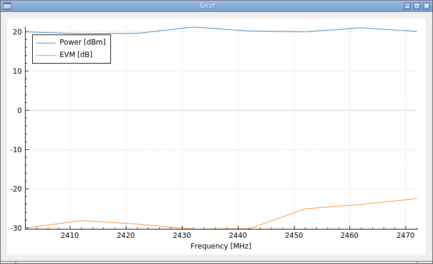

# Giraf - Real-time CSV file plotting utility

The program is written in Qt Creator, should anyone wish to modify it.

It's aim is to provide a simple command line interface for opening a graph where the CSV data is plotted while it is being written by another process. For example, to read the file `test.csv` looking like this:

    Frequency [MHz],Power [dBm],EVM [dB]
    2402,20.0,-30.0
    2412,19.5,-28.1
    2422,19.6,-29.0
    2432,21.2,-30.3
    2442,20.2,-30.2
    2452,20.0,-25.1
    2462,21.0,-24.0
    2472,20.1,-22.5

where the first row contains labels, the first column contains x-axis data, and the two last rows contain measurement data, the following command is executed:

    giraf -l0 -x0 -c1 -c2 test.csv

The resulting graph is then

and when new lines are appended to `test.csv`, the graph will update as well.
    
The specific command line options are seen by executing

    giraf -h

The file is reloaded when the `<Space>` is pressed.

Being able to visualize CSV data in real-time is very useful, for example, when doing automated measurements where the data is appended to a CSV file continuously. Being able to see the data makes any erroneous measurements easy to spot.

